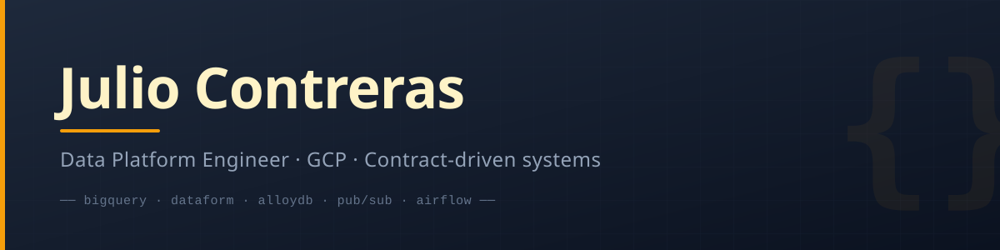

<!-- HEADER -->

 

&nbsp;
&nbsp;

---

<!-- ABOUT ME -->
### <samp>▸ About</samp>

<samp>

I'm a **Data Platform Engineer** based in Mexico.

I work on the infrastructure and services that let data teams move fast
without breaking things: pipelines, orchestration, storage layers, and the
glue between them. Most of my day-to-day lives on **GCP**.

I care about systems that are **reliable, easy to operate, and simple to
reason about** — because the best platform is the one nobody has to think
about.

- 🧱 **Platform thinking** — reusable components over one-off solutions
- 🔁 **Reliability first** — retries, timeouts, and idempotency as defaults
- 📦 **Clear interfaces** — between services, teams, and data
- 🚨 **Observable by design** — if it can fail, it should say so loudly

</samp>

---

<!-- GITHUB STATS -->
### <samp>▸ GitHub History</samp>

---

<!-- STACK -->
### <samp>▸ Stack</samp>

**☁️ Cloud**
 

  

**🔄 Orchestration & Transformation**
 

  

**🛢 Databases**
 

  

**⚙️ Code & Delivery**
 

---

<!-- CURRENTLY EXPLORING -->
### <samp>▸ Currently exploring</samp>

<samp>

- 🏗 **Terraform** — bringing infrastructure under version control
- ✅ **Data quality** — making validation a first-class concern
- 🔗 **Lineage** — understanding how data flows end to end
- 📈 **Observability** — going beyond logs and metrics

</samp>

---

 

<i>Building things that are boring to operate and easy to reason about.</i>

  

